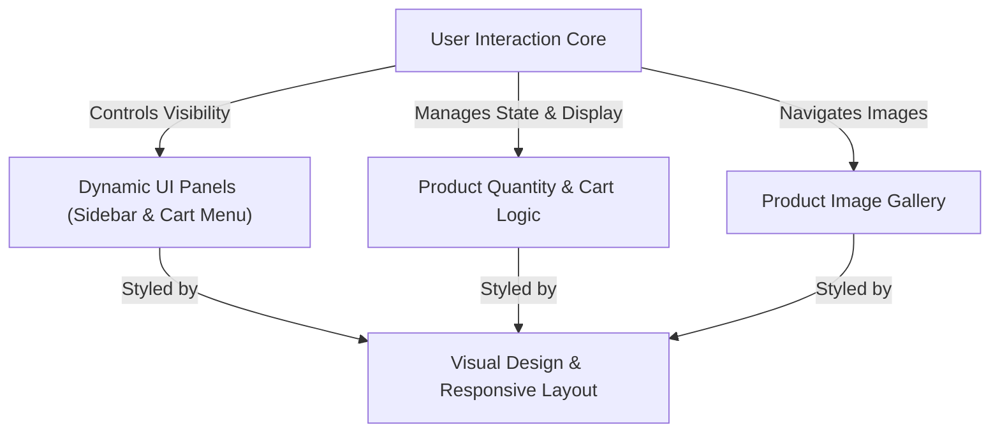
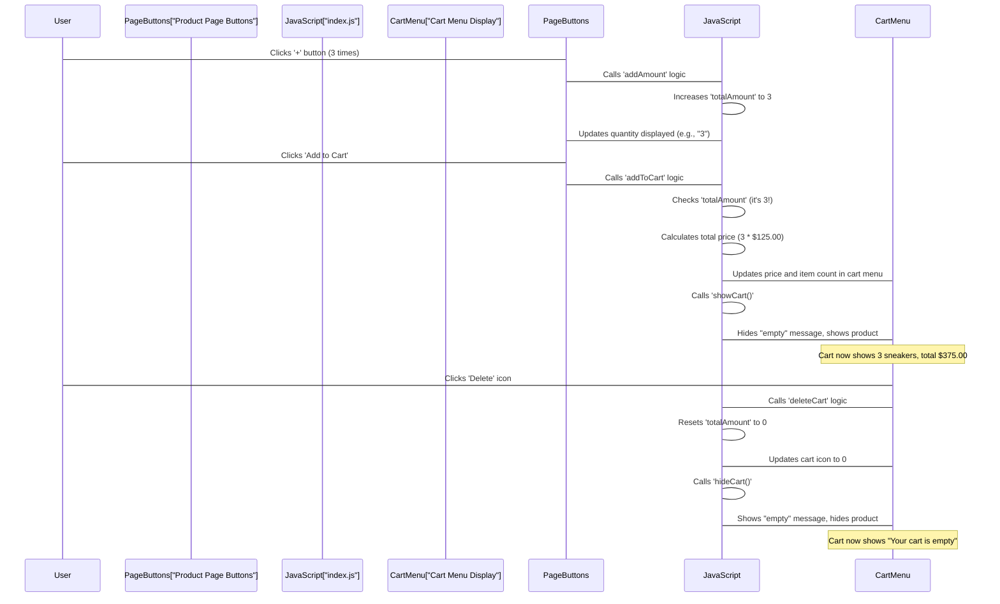
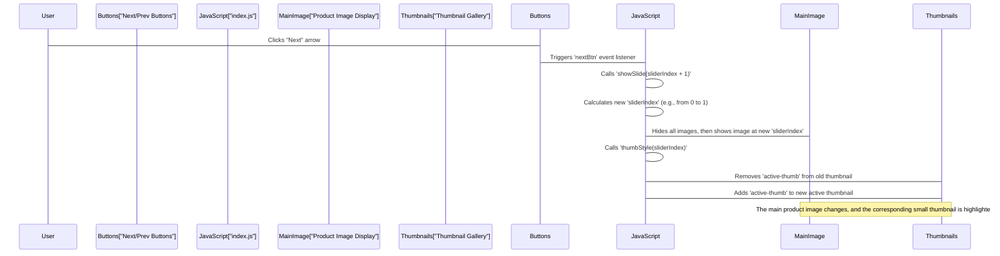
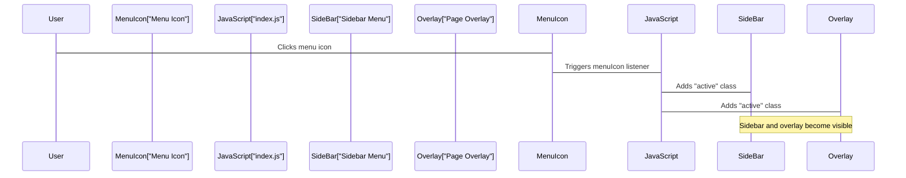
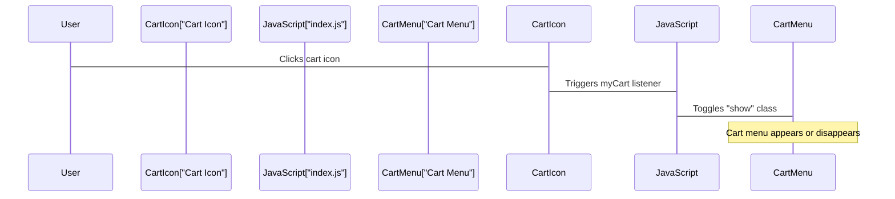
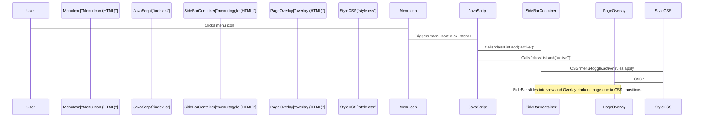
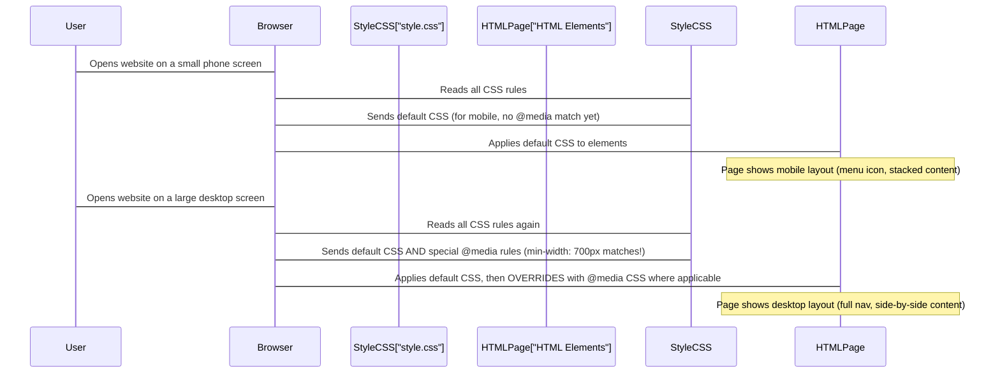

# Tutorial: ecommerce-product-page

This project is an *interactive e-commerce product page* that lets you explore a product. You can **browse different images** of the item, **adjust the quantity** you want to buy, and **add it to your shopping cart**. It also features a *dynamic sidebar menu* and a *pop-up cart display*, ensuring a smooth experience on any device.


## Visual Overview



## Chapters

1. [Product Quantity & Cart Logic
](01_product_quantity___cart_logic_.md)
2. [Product Image Gallery
](02_product_image_gallery_.md)
3. [User Interaction Core
](03_user_interaction_core_.md)
4. [Dynamic UI Panels (Sidebar & Cart Menu)
](04_dynamic_ui_panels__sidebar___cart_menu__.md)
5. [Visual Design & Responsive Layout
](05_visual_design___responsive_layout_.md)

# Chapter 1: Product Quantity & Cart Logic

Imagine you're at a shop, picking out items to buy. You don't just grab things randomly; you count how many you want, keep a running total of the cost, and make sure your basket shows what's inside. In our e-commerce product page, the "Product Quantity & Cart Logic" does exactly this for your online shopping experience!

It's like having a smart calculator and an organized assistant rolled into one. This system keeps track of how many items you want, figures out the total price you'll pay, and makes sure your online shopping cart always reflects what you've added (or removed!). If your cart is empty, it politely shows an "empty" message; if it has items, it shows them clearly, making your shopping journey smooth and clear.

Let's look at a common scenario:
**Use Case: Adding and Removing Sneakers**
You're browsing the product page for "Fall Limited Edition Sneakers." You want to buy 3 pairs. You'll use plus and minus buttons to set the quantity, click "Add to Cart," see the total price, and then later decide to remove them all. This chapter will show you how our project handles these steps.

## How We Count Your Items

First, we need a way to count how many items the user wants *before* they even add them to the cart.

**The Quantity Counter (`totalAmount`)**

In our project, we use a special JavaScript variable named `totalAmount`. Think of `totalAmount` as a digital notepad where we write down the current number of sneakers you're interested in. It starts at `0`.

```javascript
// index.js
let totalAmount = 0; // Our notepad to track item quantity
```

This `totalAmount` variable will hold the number of items you're planning to buy.

**Increasing and Decreasing Quantity**

On the product page, you'll see a plus `+` button and a minus `-` button next to a number.
*   When you click the `+` button, we want to add one to `totalAmount`.
*   When you click the `-` button, we want to subtract one from `totalAmount`, but we can't go below zero!

Let's see how our code (`index.js`) handles this:

```javascript
// index.js
// ... (other code)

// When the plus button is clicked
addAmount.addEventListener("click", () => {
    totalAmount++; // Add 1 to our notepad
    // Update the number shown on the page for the user
    document.getElementById("totalAmount").textContent = `${totalAmount}`;
});

// When the minus button is clicked
decreaseAmount.addEventListener("click", () => {
    if(totalAmount > 0) { // Only decrease if we have items
        totalAmount--; // Subtract 1 from our notepad
    }
    // Update the number shown on the page for the user
    document.getElementById("totalAmount").textContent = `${totalAmount}`;
});
// ... (other code)
```
When you click the `+` button, `totalAmount` goes up by one, and the number displayed next to the buttons also updates. For example, if `totalAmount` is 0 and you click `+`, it becomes 1. If you then click `-`, it goes back to 0. It will never go to -1.

## Adding Items to Your Cart

Once you've decided on the quantity, you'll hit the "Add to Cart" button. This is where the magic happens:

1.  **Check Quantity:** First, we make sure you actually want to add something (not zero items).
2.  **Calculate Total Price:** We take the price of one item and multiply it by your `totalAmount`.
3.  **Update Cart Display:** We show the new total price and the number of items in a small icon usually found near your profile picture.
4.  **Show the Cart:** If the cart was previously empty, we make sure it now shows the items you've added.

Here's a simplified look at the `addToCart` logic in `index.js`:

```javascript
// index.js
// ... (other code)

addToCart.addEventListener("click", () => {
    if (totalAmount === 0) { // If user clicked "Add to Cart" with 0 items
        return; // Do nothing and stop here
    };

    const sneakersPrice = 125.00; // Price of one pair
    const totalCartPrice = sneakersPrice * totalAmount; // Calculate total cost

    // Update the price displayed inside the cart
    document.getElementById("total").textContent = `$${totalCartPrice.toFixed(2)}`;
    // Update the small number next to the cart icon (e.g., "3" items)
    document.getElementById("cartItems").textContent = totalAmount;

    showCart(); // Call a function to display the cart's contents
});
// ... (other code)
```
When you click "Add to Cart" (and `totalAmount` is more than 0), the project calculates the price (e.g., 3 pairs * $125.00 = $375.00) and updates both the price displayed in the cart and the little number on the cart icon. It then ensures the cart menu shows the actual product.

## Making the Cart Look Empty or Full

Our project has two special functions, `hideCart()` and `showCart()`, which decide whether your cart looks "empty" or shows the products you've added.

-   `hideCart()`: Hides the product details and checkout button, and displays an "Your cart is empty" message.
-   `showCart()`: Hides the "empty" message and shows the product details and checkout button.

These functions manipulate `hidden` CSS classes on different parts of the cart menu (`index.html`).

```javascript
// index.js
// ... (other code)

function hideCart() {
    document.getElementById("emptyMssg").classList.remove("hidden"); // Show "Your cart is empty"
    document.getElementById("productContainer").classList.add("hidden"); // Hide product picture and price
    document.getElementById("checkoutBtn").classList.add("hidden"); // Hide checkout button
}

function showCart() {
    document.getElementById("emptyMssg").classList.add("hidden"); // Hide "Your cart is empty"
    document.getElementById("productContainer").classList.remove("hidden"); // Show product picture and price
    document.getElementById("checkoutBtn").classList.remove("hidden"); // Show checkout button
}
// ... (other code)
```
Initially, when the page loads, `hideCart()` is called to make sure your cart starts off empty. When you add items, `showCart()` is called to reveal the products.

## Removing Items from Your Cart

What if you change your mind? Our project also has a "Delete" button inside the cart. When you click it, we want to:

1.  **Reset Quantity:** Set `totalAmount` back to `0`.
2.  **Clear Cart Display:** Set the small cart icon count back to `0`.
3.  **Make Cart Empty:** Call `hideCart()` to show the "Your cart is empty" message again.

Here's the code for the `deleteCart` button:

```javascript
// index.js
// ... (other code)

deleteCart.addEventListener("click", () => {
    totalAmount = 0; // Reset our item count to zero
    document.getElementById("cartItems").textContent = 0; // Clear the number on the cart icon
    hideCart(); // Make the cart look empty
});
```
Clicking the delete button essentially reverses the "Add to Cart" action, clearing everything out and presenting an empty cart.

## Putting It All Together: A Behind-the-Scenes Look

Let's visualize the journey of adding and removing items from the cart.


As you can see, the JavaScript acts as the central brain, responding to your clicks, doing calculations, and telling the page what to show or hide!

## Summary

In this first chapter, we explored the core logic behind managing product quantities and the shopping cart:

*   We learned how `totalAmount` keeps track of the chosen quantity using `addAmount` and `decreaseAmount` buttons.
*   We saw how the "Add to Cart" button takes this quantity, calculates the total price, and updates the cart's visible contents.
*   We understood the role of `showCart()` and `hideCart()` functions in dynamically changing the cart's appearance.
*   Finally, we looked at how the `deleteCart` button clears the cart and resets the quantity.

This fundamental logic ensures that your customers have a clear and interactive way to manage their desired items and see their shopping cart's status at all times.

Next, we'll dive into how the project handles the different product images and lets users switch between them, making the product page visually appealing and interactive. Head over to [Product Image Gallery](02_product_image_gallery_.md) to learn more!

# Chapter 2: Product Image Gallery

In our last chapter, [Product Quantity & Cart Logic](01_product_quantity___cart_logic_.md), we learned how to keep track of how many items a customer wants and how to update their shopping cart. But what if a customer wants to see the product from different angles before adding it to their cart? A single picture just isn't enough!

This is where the **Product Image Gallery** comes in. Imagine it like a digital photo album for your product. Instead of just one photo, you have many, and you can easily flip through them to see every detail. This system makes sure your customers can thoroughly inspect the item they're interested in, making their online shopping experience much richer.

## Looking at All Angles: Our Use Case

Let's say a customer is looking at the "Fall Limited Edition Sneakers." They want to see what the shoes look like from the side, the back, and maybe even a close-up of the sole. Our product image gallery needs to allow them to:
1.  **Click "Next" or "Previous" arrows** to smoothly move between the different pictures.
2.  **Click a small preview (thumbnail)** directly to jump to a specific image they want to see larger.

No matter how they switch, only one main image should be visible at a time, and the small preview that matches the big image should always be highlighted.

## How Our Digital Photo Album Works

Our image gallery uses a few key pieces to achieve this "digital photo album" experience:

### 1. The Main Pictures (`slides`)

First, we need all the big pictures of our product. In our project, these are stored as a collection of `` tags inside a `<div>` with the ID `slides`. Think of `slides` as a stack of photo prints, but only one is on top (visible) at a time.

In our `index.js` file, we gather all these image elements:

```javascript
// index.js
const slides = document.querySelectorAll("#slides img");
// This finds all  tags inside the "slides" div.
// It creates a list, like [image1, image2, image3, image4]
```
These images are initially "hidden" using CSS, meaning they are invisible. We'll use JavaScript to decide which one to "show."

### 2. Keeping Track: The `sliderIndex`

To know which picture is currently being shown (or should be shown next), we use a special variable called `sliderIndex`.

```javascript
// index.js
let sliderIndex = 0; // Starts at 0, meaning the first image in our list
```
`sliderIndex` is like remembering which page number you're on in a book. If `sliderIndex` is `0`, you're on the first image; if it's `1`, you're on the second, and so on.

### 3. Showing Only One Picture (`showSlide` Function)

The `showSlide` function is the core of our gallery. Its job is to:
*   Make sure we don't go past the last picture or before the first (it "wraps around" if you click "next" on the last picture, it goes to the first, and vice-versa).
*   Hide *all* the main pictures.
*   Then, show *only* the specific picture determined by `sliderIndex`.

Here's a simplified look at how `showSlide` works:

```javascript
// index.js
function showSlide (index) {
    // This part ensures 'index' is always valid (e.g., 0, 1, 2, or 3)
    if (index >= slides.length) { // If we went past the last image
        sliderIndex = 0; // Go back to the first image
    } else if (index < 0) { // If we went before the first image
        sliderIndex = slides.length - 1; // Go to the last image
    } else {
        sliderIndex = index; // Otherwise, use the given index
    }

    // Hide ALL main images first
    slides.forEach(slide => {
        slide.classList.remove("show"); // Remove "show" class
        slide.classList.add("hidden");  // Add "hidden" class
    });

    // Then, show ONLY the image at the current sliderIndex
    slides[sliderIndex].classList.remove("hidden"); // Remove "hidden"
    slides[sliderIndex].classList.add("show");      // Add "show"
}
```
This function uses CSS classes (`hidden` and `show`) to control the visibility. `display: none;` hides an element completely, while `display: block;` (or whatever `show` applies) makes it visible.

When the page first loads, `showSlide(sliderIndex);` (which is `showSlide(0)`) is called to display the very first product image.

### 4. Navigating with Arrows (`nextBtn`, `prevBtn`)

The "Next" and "Previous" arrows allow users to "flip" through the pictures one by one.

*   `nextBtn` (the right arrow) will increase `sliderIndex` by one.
*   `prevBtn` (the left arrow) will decrease `sliderIndex` by one.

```javascript
// index.js
// Find our next/previous arrow buttons
const nextBtn = document.getElementById("next");
const prevBtn = document.getElementById("prev");

// When 'Next' is clicked, show the next slide
nextBtn.addEventListener("click", () => {
    showSlide(sliderIndex + 1); // Ask showSlide to go to the next index
});

// When 'Previous' is clicked, show the previous slide
prevBtn.addEventListener("click", () => {
    showSlide(sliderIndex - 1); // Ask showSlide to go to the previous index
});
```
These simple functions just tell `showSlide` where to go next. `showSlide` then handles all the complex logic of making the correct image visible and wrapping around the ends.

### 5. Small Previews (`thumbnails`)

Below the main product image, you'll see a row of smaller images. These are called **thumbnails**. They allow users to quickly jump to any specific image without having to click "next" multiple times.

Each thumbnail in `index.html` has an `onclick` attribute that calls our JavaScript functions:

```html
<!-- index.html -->
<div id="thumbnails" class="her-img_thumbnails container hide">
  <div>
    
  </div>
  <div>
    
  </div>
  <!-- ... more thumbnails ... -->
</div>
```
Notice `onclick="thumbStyle(0); showSlide(0);"`. When you click a thumbnail, it directly tells `showSlide` which image index to go to (e.g., `0` for the first image, `1` for the second, etc.).

### 6. Highlighting the Active Thumbnail (`thumbStyle` Function)

To help users know which image they are currently viewing, the thumbnail matching the main image needs to be highlighted. We use the `thumbStyle` function for this, which adds a special `active-thumb` CSS class to the correct thumbnail and removes it from others.

```javascript
// index.js
const thumbnails = document.querySelectorAll(".thumb");

function thumbStyle(index) {
    // Remove the 'active-thumb' highlight from ALL thumbnails first
    thumbnails.forEach(element => {
        element.classList.remove("active-thumb");
    });

    // Add the 'active-thumb' highlight to the selected thumbnail
    thumbnails[index].classList.add("active-thumb");
}
```
When the page loads, `thumbnails[0].classList.add("active-thumb");` is called to ensure the first thumbnail is highlighted from the start.

## Putting It All Together: A Behind-the-Scenes Look

Let's see how all these pieces work together when a user interacts with the image gallery.

### Scenario 1: Clicking the "Next" Arrow



### Scenario 2: Clicking a Specific Thumbnail

```mermaid
sequenceDiagram
    participant User
    participant Thumbnails["Thumbnail Gallery"]
    participant JavaScript["index.js"]
    participant MainImage["Product Image Display"]

    User->Thumbnails: Clicks a small image (e.g., the 3rd one)
    Thumbnails->JavaScript: Triggers 'onclick="thumbStyle(2); showSlide(2);"'
    JavaScript->MainImage: Calls 'showSlide(2)'
    MainImage->MainImage: Hides current image, shows 3rd image
    JavaScript->Thumbnails: Calls 'thumbStyle(2)'
    Thumbnails->Thumbnails: Removes 'active-thumb' from all, then adds to 3rd thumbnail
    Note over MainImage,Thumbnails: The main product image jumps to the selected image, and its thumbnail is highlighted!
```

## Summary

In this chapter, we explored how our project creates an interactive Product Image Gallery:

*   We use `slides` (a list of image elements) and a `sliderIndex` variable to keep track of which image is currently displayed.
*   The `showSlide` function is the brain, handling the logic to make only one main image visible at a time and ensuring smooth transitions (including wrapping around).
*   "Next" and "Previous" arrows (`nextBtn`, `prevBtn`) simply tell `showSlide` to advance or go back one image.
*   `thumbnails` (the small preview images) allow users to directly select any image by calling `showSlide` and `thumbStyle` with the desired image's index.
*   The `thumbStyle` function ensures that the small preview corresponding to the currently displayed image is always visually highlighted with the `active-thumb` class.

This interactive gallery makes sure customers can easily explore every detail of a product before making a purchase decision.

Next, we'll dive into the broader aspects of how the project handles different user interactions, from opening menus to closing pop-ups, creating a truly responsive and engaging user experience. Head over to [User Interaction Core](03_user_interaction_core_.md) to learn more!

# Chapter 3: User Interaction Core

In our previous chapters, we learned how to manage your shopping cart with [Product Quantity & Cart Logic](01_product_quantity___cart_logic_.md) and how to browse product photos with the [Product Image Gallery](02_product_image_gallery_.md). These features allowed you to click buttons and see things change on the page. But how does the website *know* you clicked, and how does it *make* those changes happen?

This is where the **User Interaction Core** comes in! Imagine your website is a living thing. This "core" acts as its senses and its hands:

*   **The Listener (Senses):** It constantly pays attention to what you, the user, are doing. Are you clicking a button? Moving your mouse over an image? This is like the website's "ears" and "eyes."
*   **The Puppet Master (Hands):** Once it "hears" or "sees" your action, it becomes a puppet master, pulling strings to change the website. It can update text, show new sections, hide old ones, or change how elements look.

This system is the fundamental layer for *all* the dynamic (changing) behavior you see on the product page. Every time something pops up, disappears, or changes its number, this core is at work!

## Our Central Use Case: Opening and Closing Panels

Let's look at a common scenario where the User Interaction Core is essential:
**Use Case: Accessing the Sidebar Menu and Cart Details**

You're on a mobile device and want to see the main navigation links, which are hidden in a sidebar. You also want to quickly check what's in your cart without leaving the page.

Our project needs to:
1.  **Open the sidebar menu** when you click a special "menu" icon.
2.  **Close the sidebar menu** when you click a "close" button inside it.
3.  **Toggle the cart menu** (show it if hidden, hide it if shown) when you click the cart icon.

These actions require the website to "listen" for your clicks and then "act" by showing or hiding the right parts of the page.

## How the Website "Listens" and "Acts"

Our project uses JavaScript to make the website interactive. Here are the key ideas:

### 1. Events: What the User Does

In web terms, an "event" is something that happens in the browser, usually because of a user's action.
*   **Clicking** a button (`click` event)
*   **Hovering** over an image (`mouseover` event)
*   **Typing** in a box (`keydown` event)

For our use case, we are mainly interested in `click` events.

### 2. Event Listeners: The Website's "Ears"

To react to an event, we attach an **Event Listener** to a specific element on the page. Think of an event listener as a tiny guard dog assigned to a particular object (like a button). This guard dog waits patiently. The moment it detects its assigned action (e.g., a "click" on its button), it barks and tells the JavaScript code to do something!

In JavaScript, we use `addEventListener()` to set up these listeners:

```javascript
// index.js
// Find the menu icon (our button)
const menuIcon = document.getElementById("menuIcon");

// Tell the menu icon to "listen" for a "click"
menuIcon.addEventListener("click", () => {
    // When clicked, run the code inside these curly braces {}
    console.log("Menu icon was clicked!");
});
```
This code snippet means: "Find the element with the ID `menuIcon`. When someone clicks it, perform the actions specified within the function."

### 3. DOM Manipulation: The Website's "Hands"

Once the listener "hears" an event, the JavaScript code takes action by manipulating the **DOM (Document Object Model)**. The DOM is like a tree-like map of everything on your webpage (all your HTML tags). JavaScript can reach into this map and change things:
*   Change text inside an element.
*   Change the "source" of an image.
*   **Add or remove CSS classes** to change how an element looks or if it's visible. This is what we use heavily in this project!

For example, to show or hide elements, we add or remove special CSS classes like `hidden` or `active`.

*   `element.classList.add("className")`: Adds a CSS class to an element.
*   `element.classList.remove("className")`: Removes a CSS class from an element.
*   `element.classList.toggle("className")`: If the class is there, remove it; if it's not, add it. It "flips" the state.

Many HTML elements start with a `hidden` class in `index.html` to make them invisible by default. Our JavaScript then removes this class when we want them to appear. Conversely, to hide something, we add `hidden` back.

## How We Implement the Use Case

Let's see how our project uses these concepts for the sidebar and cart menu.

### 1. Getting Our Elements (Finding the "Puppets")

First, we need to get references to the HTML elements we want to control. We use `document.getElementById()` to find them by their unique IDs.

```javascript
// index.js
const menuIcon = document.getElementById("menuIcon"); // The menu icon button
const closeSideBar = document.getElementById("close"); // The 'X' button in sidebar
const sideBar = document.getElementById("sideBar");   // The sidebar menu itself
const myCart = document.getElementById("card");       // The cart icon button
const cartMenu = document.getElementById("cartMenu"); // The cart details pop-up
const overlay = document.getElementById("overlay");   // The semi-transparent background
```
Each of these `const` variables now holds a reference to a specific part of our `index.html` page.

### 2. Opening the Sidebar: Listening for the Menu Icon

When the user clicks the `menuIcon`, we want the `sideBar` to become visible and a dark `overlay` to appear behind it to focus attention.

```javascript
// index.js
menuIcon.addEventListener("click", () => {
    sideBar.classList.add("active");    // Make the sidebar visible (CSS handles this)
    overlay.classList.add("active");    // Show the dark overlay (CSS handles this)
});
```
*Output*: When you click the menu icon (usually a "hamburger" icon), the sidebar smoothly slides into view from the side, and the rest of the page gets a dark, semi-transparent overlay.

### 3. Closing the Sidebar: Listening for the Close Button

When the user clicks the `closeSideBar` button (the "X" icon), we want the `sideBar` and `overlay` to disappear.

```javascript
// index.js
closeSideBar.addEventListener("click", () => {
    sideBar.classList.remove("active");    // Hide the sidebar
    overlay.classList.remove("active");    // Hide the dark overlay
});
```
*Output*: Clicking the "X" button inside the sidebar makes the sidebar slide back out of view and the dark overlay disappear, returning the page to normal.

### 4. Toggling the Cart Menu: Listening for the Cart Icon

For the cart menu, we want a single click on the `myCart` icon to *toggle* its visibility. If it's hidden, show it. If it's shown, hide it.

```javascript
// index.js
myCart.addEventListener("click", () => {
    cartMenu.classList.toggle("show"); // This flips the 'show' class on or off
});
```
*Output*: If the cart menu is not visible, clicking the cart icon makes it pop up. If it's already visible, clicking the cart icon makes it disappear.

## Putting It All Together: A Behind-the-Scenes Look

Let's visualize these interactions with our "listener" and "puppet master" concept.

### Scenario 1: Opening the Sidebar Menu



### Scenario 2: Closing the Sidebar Menu


### Scenario 3: Toggling the Cart Menu



You can see how the `JavaScript` code in `index.js` is the central brain, always listening for your actions and then telling the different parts of the HTML page (the "puppets") how to change their appearance.

## Summary

In this chapter, we unpacked the **User Interaction Core**, which is the fundamental system making our product page interactive:

*   We learned about **Events**, which are the actions users perform (like clicking).
*   We saw how **Event Listeners** (`addEventListener`) act as the website's "ears," waiting for specific events on specific elements.
*   We understood that **DOM Manipulation**, specifically adding or removing CSS classes (`classList.add`, `classList.remove`, `classList.toggle`), is how JavaScript acts as the "puppet master" to change the website's appearance or content.

This core concept is not just for opening menus! It's the very same system that powers the quantity counter buttons and the image gallery we discussed in [Product Quantity & Cart Logic](01_product_quantity___cart_logic_.md) and [Product Image Gallery](02_product_image_gallery_.md). Every interactive part of the website relies on this foundational "listen and act" principle.

Next, we'll dive deeper into the structure and styling of these dynamic panels—the sidebar and cart menu—to see how they are built and how they respond to different screen sizes. Head over to [Dynamic UI Panels (Sidebar & Cart Menu)](04_dynamic_ui_panels__sidebar___cart_menu__.md) to learn more!

# Chapter 4: Dynamic UI Panels (Sidebar & Cart Menu)

In our last chapter, [User Interaction Core](03_user_interaction_core_.md), we learned the fundamental principle of how our website "listens" for your clicks and "acts" by changing things on the page using JavaScript. We saw how clicking the menu icon makes the sidebar appear, and clicking the cart icon shows the cart menu.

But how do these elements actually *look* hidden by default? How do they *pop out smoothly* when activated? And what about that cool semi-transparent background that dims the rest of the page? This is where **Dynamic UI Panels** come into play!

Think of the sidebar and the cart menu as two clever, hidden compartments on our webpage. They are tucked away out of sight, saving space and keeping the page clean. When you click a special button, these compartments don't just *jump* into view; they *smoothly slide or fade* into place, like magic! Along with them, a semi-transparent layer often covers the rest of the page, making sure your focus is entirely on the popping-out panel. This chapter will reveal the secrets behind making these dynamic UI panels work.

## Our Central Use Case: A Smooth Reveal

Let's recall our goal from Chapter 3:
**Use Case: Accessing the Sidebar Menu and Cart Details**

You want to see the main navigation links (on mobile) or quickly check your shopping cart. Our project needs these panels to:
1.  **Start hidden** when the page loads.
2.  **Appear smoothly** (slide or fade) when a specific icon is clicked.
3.  **Disappear smoothly** when a close button or the icon itself is clicked again.
4.  **Show a page overlay** to highlight the active panel.

The "Dynamic UI Panels" concept handles how the HTML elements are structured and, more importantly, how their appearance is controlled by CSS to achieve these smooth, interactive pop-outs.

## How Our Hidden Compartments Work

We use a combination of HTML, CSS, and the JavaScript "listening" skills we learned in [User Interaction Core](03_user_interaction_core_.md).

### 1. The HTML Structure: The Compartments Themselves

First, we need the actual HTML elements that will become our sidebar and cart menu. They are just regular `<div>` elements, but they contain all the links or product details.

Here's a simplified look at their structure in `index.html`:

```html
<!-- index.html (Simplified) -->
<body>
  <header>
    <div id="overlay"></div> <!-- Our semi-transparent page overlay -->
    <div class="header-content container">
      <!-- ... menuIcon, cart icon ... -->
      <div id="cartMenu" class="cart-container">
        <!-- Cart content (products, total price, checkout button) -->
      </div>
    </div>
    <div id="sideBar" class="menu-toggle">
      <div class="side-bar">
        <!-- Sidebar content (navigation links) -->
      </div>
    </div>
  </header>
  <!-- ... rest of the page ... -->
</body>
```
Notice `id="overlay"`, `id="cartMenu"`, and `id="sideBar"`. These IDs are crucial because our JavaScript will use them to grab these specific elements and control them.

### 2. The CSS: Making Them Hidden and Smoothly Appearing

This is where the real magic of "dynamic panels" happens. Our CSS (`style.css`) defines how these elements look by default (hidden) and how they change when our JavaScript adds or removes special classes.

#### Hiding the Sidebar and Overlay

By default, the `sideBar` (which is actually wrapped in a `menu-toggle` div that controls its visibility) is pushed off-screen and made invisible. The `overlay` is also hidden.

```css
/* style.css (Simplified) */
.menu-toggle {
    /* Hides the sidebar by default */
    transform: translateX(-100%); /* Pushes it off the left side of the screen */
    opacity: 0;                   /* Makes it completely transparent */
    pointer-events: none;         /* Prevents interaction when hidden */
    transition: transform 0.3s ease, opacity 0.3s ease; /* Smooth animation */
}

#overlay {
    display: none; /* Hides the overlay by default */
    background-color: rgba(0, 0, 0, .5); /* Semi-transparent black */
    /* ... other positioning for full screen ... */
}
```
*Output*: When the page first loads, you won't see the sidebar or the dark overlay. They are completely out of view.

#### Making the Sidebar and Overlay Appear

When JavaScript adds the `active` class to `menu-toggle` and `overlay`, these CSS rules kick in:

```css
/* style.css (Simplified) */
.menu-toggle.active {
    transform: translateX(0);   /* Slides it back into view */
    opacity: 1;                 /* Makes it fully visible */
    pointer-events: auto;       /* Allows clicks/interactions */
}

#overlay.active {
    display: block; /* Makes the overlay visible */
}
```
*Output*: When our JavaScript adds the `active` class, the sidebar slides smoothly from the left, and the background darkens with a semi-transparent overlay. This `transition` property (`transition: transform 0.3s ease, opacity 0.3s ease;`) is what creates the smooth animation over 0.3 seconds!

#### Hiding and Showing the Cart Menu

The cart menu uses a similar principle but might use `visibility` and `opacity` properties, sometimes combined with `transform` for a slight animation.

```css
/* style.css (Simplified) */
.cart-container {
    visibility: hidden; /* Hides the cart menu by default */
    opacity: 0;         /* Makes it transparent */
    transition: opacity .3s ease, visibility .3s ease; /* Smooth animation */
    /* ... other positioning for top-right corner ... */
}

.cart-container.show {
    visibility: visible; /* Makes it visible */
    opacity: 1;          /* Makes it fully opaque */
}
```
*Output*: The cart menu is invisible until the `show` class is added, at which point it fades smoothly into view.

### 3. The JavaScript: The Puppet Strings (Recap & Connection)

As we saw in [User Interaction Core](03_user_interaction_core_.md), our JavaScript `index.js` is the "puppet master" that adds or removes these CSS classes in response to your clicks.

*   To open the sidebar and overlay:
    ```javascript
    // index.js (Simplified)
    menuIcon.addEventListener("click", () => {
        sideBar.classList.add("active"); // Add 'active' to show sidebar
        document.getElementById("overlay").classList.add("active"); // Show overlay
    });
    ```
*   To close the sidebar and overlay:
    ```javascript
    // index.js (Simplified)
    closeSideBar.addEventListener("click", () => {
        sideBar.classList.remove("active"); // Remove 'active' to hide sidebar
        document.getElementById("overlay").classList.remove("active"); // Hide overlay
    });
    ```
*   To toggle the cart menu:
    ```javascript
    // index.js (Simplified)
    myCart.addEventListener("click", () => {
        cartMenu.classList.toggle("show"); // Toggle 'show' to show/hide cart
    });
    ```
These small JavaScript snippets are the direct link between user actions and the CSS rules that make the panels dynamically appear and disappear.

## Putting It All Together: A Behind-the-Scenes Look

Let's visualize how these three parts (HTML, CSS, JavaScript) work in harmony to create the dynamic sidebar.


This diagram shows how a single click sets off a chain reaction: JavaScript adds classes, and CSS responds by smoothly changing the element's appearance.

## Summary

In this chapter, we unpacked the concept of **Dynamic UI Panels (Sidebar & Cart Menu)**:

*   We learned that these panels are primarily HTML `div` elements that start in a **hidden state** using specific CSS properties like `transform`, `opacity`, and `display`.
*   The magic of smooth appearance comes from CSS `transition` properties, which animate changes when CSS classes are added or removed.
*   JavaScript (as covered in [User Interaction Core](03_user_interaction_core_.md)) acts as the controller, adding (`classList.add`) or removing (`classList.remove`) these "active" or "show" CSS classes based on user clicks, making the panels pop out or tuck away.
*   The `overlay` element works in tandem, darkening the background to focus attention on the active panel.

Understanding this interplay between HTML structure, CSS styling, and JavaScript control is key to building interactive and modern web interfaces. These dynamic panels are a perfect example of how small changes in CSS classes can lead to big, impressive visual effects!

Next, we'll shift our focus to the overall look and feel of the product page, exploring how design choices and responsive layouts ensure the page looks great on any screen size. Head over to [Visual Design & Responsive Layout](05_visual_design___responsive_layout_.md) to learn more!

# Chapter 5: Visual Design & Responsive Layout

In our last chapter, [Dynamic UI Panels (Sidebar & Cart Menu)](04_dynamic_ui_panels__sidebar___cart_menu__.md), we learned how to make hidden elements like the sidebar and cart menu pop out smoothly. We saw how JavaScript triggers these changes by adding or removing CSS classes. Now, let's zoom out and look at the bigger picture: how does our entire product page look good, and how does it make sure it looks good on *any* screen size, from a tiny phone to a huge desktop monitor?

This is where **Visual Design & Responsive Layout** comes in! Imagine your website is a person.
*   **Visual Design** is like choosing their clothes, hair, and overall style. It defines the colors they wear, the fonts they use for speaking (text), and how neat and organized everything looks.
*   **Responsive Layout** is like ensuring this person can wear the same outfit (website) comfortably and stylishly, whether they are sitting at a small desk, on a crowded bus, or giving a presentation on a large stage. The outfit automatically adjusts so they always look good and can move freely, no matter the situation.

This concept ensures that our product page is not only functional but also beautiful and easy to use for everyone, no matter what device they are using to browse.

## Our Central Use Case: A Seamless Shopping Experience on Any Device

Let's imagine you're a customer.
**Use Case: Browsing Sneakers on Different Devices**

You first check out the "Fall Limited Edition Sneakers" on your small smartphone during your commute. The product image is large, the text is easy to read, and the buttons are big enough to tap. Later, you arrive home and open the same page on your large desktop computer. The layout changes: the product images are still clear, the text is perfectly aligned, and the navigation menu appears, making it easy to browse other categories. The website *responded* to your screen size.

Our project achieves this seamless experience by using clever design choices and special CSS rules.

## How Our Website Dresses for Success: Visual Design

Visual design is mostly handled by **CSS (Cascading Style Sheets)**. Think of CSS as the style guide for our website. It tells the browser things like: "Make all main headings this color," "Use this specific font for all text," or "Add some space around these buttons."

### 1. Consistent Colors and Fonts (CSS Variables)

To keep the look consistent, we use **CSS Variables**. These are like shortcuts for our colors and fonts. We define them once at the top of our `style.css` file:

```css
/* style.css (simplified) */
:root {
    --base-color: white; /* Our main background color */
    --text-color: hsl(220, 13%, 13%); /* Dark text */
    --accent-color: hsl(26, 100%, 55%); /* Our bright orange brand color */
    /* ... more colors and fonts ... */
}

body {
    font-family: "Kumbh Sans", sans-serif; /* The main font for our website */
    background-color: var(--base-color); /* Use our base color variable */
    color: var(--text-color); /* Use our text color variable */
}
```
*Output*: Every part of the website that uses `var(--text-color)` will automatically have the correct dark text color. If we ever decide to change our brand color, we just change `--accent-color` in one place, and it updates everywhere!

### 2. Organizing with Spacing and Alignment (`flexbox`)

To make elements neatly arranged and easy to read, we use CSS properties like `margin` (space *outside* an element), `padding` (space *inside* an element), and `display: flex` (a powerful tool to arrange items in rows or columns).

For example, look at the price and the quantity buttons:

```css
/* style.css (simplified for mobile) */
.price-container {
    display: flex; /* Arranges items side-by-side */
    justify-content: space-between; /* Spreads items evenly */
    margin: 1em 0; /* Adds space above and below */
}

.add-to_cart {
    display: flex; /* Makes the cart icon and text align */
    align-items: center; /* Centers items vertically */
    justify-content: center; /* Centers items horizontally */
    /* ... more styling for button look ... */
}
```
*Output*: The price and the reduction percentage will sit nicely next to each other. The "Add to Cart" button will have its icon and text centered together. `display: flex` is used extensively throughout the project to arrange elements neatly, whether side-by-side or stacked.

## How Our Website Adapts: Responsive Layout

The most exciting part is making the website "respond" to different screen sizes. We do this using a CSS feature called **Media Queries**.

### 1. What are Media Queries?

Think of a media query as a special rule that says: "ONLY apply these CSS styles if the screen meets certain conditions." The most common condition is screen width.

```css
/* style.css (simplified) */

/* These are the DEFAULT styles, applied to small screens (like phones) */
nav {
    display: none; /* Hide the main navigation menu on small screens */
}
.menu-icn {
    display: block; /* Show the menu "hamburger" icon on small screens */
}

/* --- Below this line are rules for LARGER screens --- */
@media(min-width: 700px) {
    /* These rules apply ONLY if the screen is 700 pixels wide or wider */
    nav {
        display: flex; /* Show the main navigation menu on larger screens */
    }
    .menu-icn {
        display: none; /* Hide the menu "hamburger" icon on larger screens */
    }
}
```
*Output*: On a phone (less than 700px wide), you'll see a small menu icon and no full navigation bar. On a tablet or desktop (700px or wider), the menu icon disappears, and the full navigation bar with "Collections," "Men," etc., appears automatically.

### 2. How Layouts Change

Let's see how the main product section adapts:

*   **Mobile (Small Screen):** The main product image takes up the full width, and the product description (`.about`) is stacked directly below it.
*   **Desktop (Large Screen):** The product image and the description sit side-by-side, making better use of the wider screen space.

This is achieved using a media query that changes the display behavior of a parent container:

```css
/* style.css (simplified) */

/* Default (mobile) behavior: sections are stacked */
section + section {
    padding: 1em 0; /* Add space between stacked sections */
}

@media(min-width: 700px) {
    .col { /* This is the parent container for the image and product info sections */
        display: flex; /* Make the sections sit side-by-side */
        align-items: center; /* Vertically align them */
        gap: 3em; /* Add space between them */
        padding: 3em 0; /* More padding for larger screens */
    }
    .hero { /* The image section */
        flex: 1; /* Allows it to take up available space */
    }
    .about { /* The product description section */
        flex: 1; /* Allows it to take up available space */
    }

    /* Change price layout for desktop */
    .price-container {
        display: block; /* Change from flex to block to stack elements */
    }
}
```
*Output*: On small screens, the image and product details appear one after another, which is natural for scrolling vertically. On larger screens, they align horizontally (`display: flex`) creating a more spacious and organized look. Notice how the price container changes from `display: flex` (side-by-side for mobile) to `display: block` (stacked for desktop) to adjust the layout of the price and reduction percentage.

This way, our product page always presents information in the most readable and user-friendly way for the specific device being used!

## Putting It All Together: What the Browser Does

Let's visualize how your web browser handles responsive design:


As you can see, the browser is smart. It reads all your CSS, but it only applies the rules inside a `@media` query if the conditions (like screen width) are met. If a rule inside `@media` clashes with a default rule, the `@media` rule usually wins because it's more specific.

## Summary

In this final chapter, we explored the crucial concepts of **Visual Design & Responsive Layout**:

*   **Visual Design** is about the overall aesthetic, defining consistent `colors`, `fonts`, `spacing`, and `alignment` using CSS. CSS variables help keep designs consistent and easy to update.
*   **Responsive Layout** ensures the website adapts beautifully to any screen size. This is achieved using **Media Queries** in CSS, which apply different styles based on conditions like screen width.
*   We saw how elements like the navigation menu and the main product sections change their `display` properties (`none` vs. `flex`) and arrangement (`stacked` vs. `side-by-side`) to fit the screen.

Understanding these design and layout principles is essential for building modern websites that look professional and are enjoyable to use for everyone, on any device.

Congratulations! You've now completed your journey through the `ecommerce-product-page` project tutorial. You've learned about:
*   [Product Quantity & Cart Logic](01_product_quantity___cart_logic_.md)
*   [Product Image Gallery](02_product_image_gallery_.md)
*   [User Interaction Core](03_user_interaction_core_.md)
*   [Dynamic UI Panels (Sidebar & Cart Menu)](04_dynamic_ui_panels__sidebar___cart_menu__.md)
*   And finally, **Visual Design & Responsive Layout**.

You now have a solid foundation in how to build interactive, dynamic, and visually appealing web pages!
